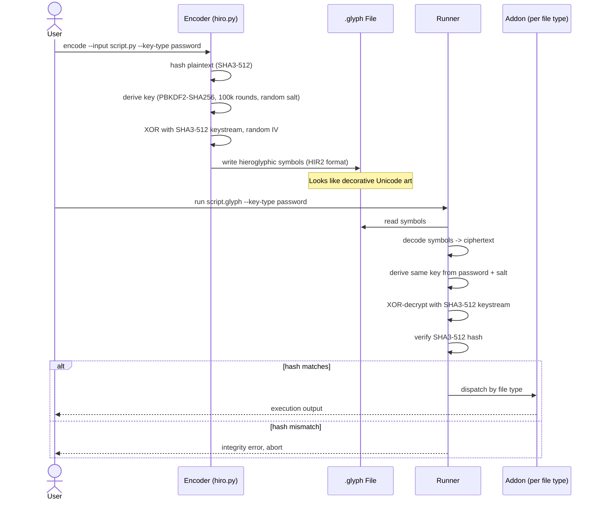
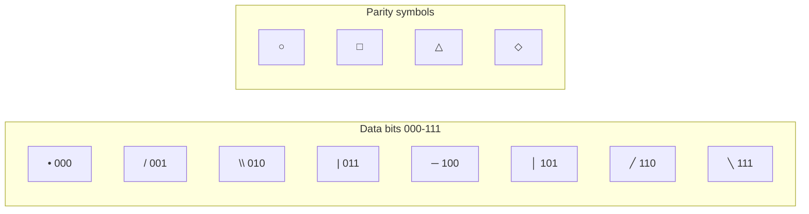
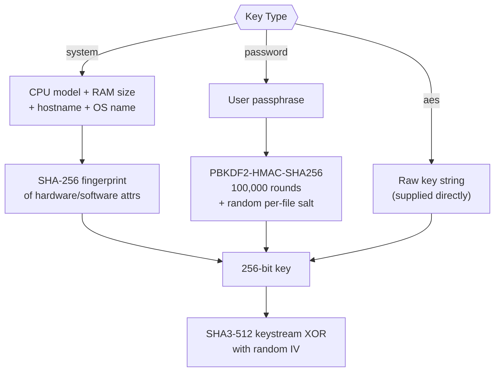
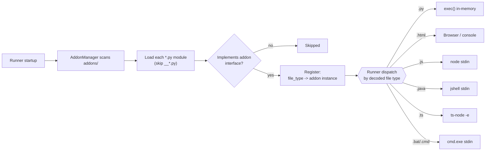

# Hiroglyph — Documentation

[](#)
[](LICENSE)
[](docs/WHITE_PAPER.md)
[](docs/WHITE_PAPER.md)
[](docs/WHITE_PAPER.md)
[](docs/HIRO_VS_AES_AND_EXE_TESTING.md)

Documentation for **Hiroglyph** (a.k.a. Project Hiro / Crypto-Hieroglyphic Encoder), a cryptographic system that transforms executable code and files into streams of Unicode hieroglyphic symbols. Encrypted content is visually indistinguishable from decorative art while remaining fully executable on authorised systems.

```
──/•□|╲──△─|╲\△╲─\│○─|│•○\─/\◇\••|○\||╱□/•\|□\//╱◇│•╲─△\//
╲─│○|╲|/□╲╱•╲◇│•─╱□/╱/|◇│─╲\○\/│╲◇╱\|•◇•││•○╱•─╲□••╲─△\//
```
*^ A real `.glyph` file — encrypted content disguised as symbols.*

> **This repository contains documentation only.** It does not include the source code, encoder/decoder implementation, test suite, or any key/fingerprint material. It exists to explain, at a technical level, what the system is and how it works.

---

## Table of Contents

- [What Is a Glyph?](#what-is-a-glyph)
- [How It Works](#how-it-works)
- [The Symbol Set](#the-symbol-set)
- [Key Types](#key-types)
- [Command-Line Interface](#command-line-interface-reference)
- [Addon System](#addon-system)
- [Documentation Index](#documentation-index)
- [Licence](#licence)

---

## What Is a Glyph?

A `.glyph` file is an encrypted, visually-encoded file that looks like a stream of Unicode symbols but secretly contains executable code or data. See [docs/WHAT_IS_A_GLYPH.md](docs/WHAT_IS_A_GLYPH.md) for a full breakdown with annotated examples.

There are two independent layers:

1. **Cryptographic layer** — a custom SHA3-512-based keystream cipher (not the AES block cipher, despite the `aes` key-type name — see note below), PBKDF2/SHA3-512 key derivation, SHA3-512 integrity hashing.
2. **Visual encoding layer** — every 3 bits of ciphertext becomes one of 8 hieroglyphic Unicode symbols.

> **Naming note:** the `aes` key type refers to the *key material* (a raw "AES-style" 256-bit key string), not the cipher itself. All three key types feed the same custom stream cipher: `keystream = SHA3-512(key ‖ IV) ‖ SHA3-512(SHA3-512(key ‖ IV)) ‖ …`, XORed against the plaintext. It is not standardised, not hardware-accelerated (no AES-NI), and has had far less public cryptanalysis than AES-256-GCM. See [docs/HIRO_VS_AES_AND_EXE_TESTING.md](docs/HIRO_VS_AES_AND_EXE_TESTING.md).

The visual layer adds no cryptographic strength on its own — all security comes from the cryptographic layer. It adds *plausible deniability*: an encrypted payload can pass as decorative Unicode art rather than obvious ciphertext.

---

## How It Works

```mermaid
flowchart LR
    A["Source File\n.py .js .html\n.ts .java .bat"] --> B["Encoder"]
    B --> C["1. Hash\nSHA3-512"]
    C --> D["2. Encrypt\nSHA3-512 keystream XOR\n+ random IV + per-file salt"]
    D --> E["3. Encode\n3 bits -> symbol\n+ parity symbols"]
    E --> F[[".glyph File\nUnicode symbols only\nno filenames, no headers"]]
    F --> G["Runner"]
    G --> H["1. Decode\nsymbol -> bits"]
    H --> I["2. Decrypt\nAES"]
    I --> J["3. Verify\nSHA3-512 hash"]
    J --> K{{"4. Execute\nor output plaintext"}}

    style F fill:#2b2140,stroke:#8b5cf6,color:#fff
    style K fill:#1f3b2c,stroke:#22c55e,color:#fff
```



1. **Hash** — the plaintext is hashed (SHA3-512) so the runner can verify integrity after decryption.
2. **Encrypt** — the plaintext is encrypted with AES using a key derived from one of three key types (below). Each encryption uses a random IV; the current on-disk format (`HIR2`) also stores a per-file random salt, defeating rainbow-table attacks across files encrypted with the same password.
3. **Encode** — the ciphertext bytes are mapped 3 bits at a time onto 8 hieroglyphic symbols, plus 4 additional parity symbols used for lightweight error correction.

Decoding reverses the process: symbols → bits → ciphertext → decrypt → verify hash → execute (or output as plaintext, if the operation is a decode rather than a run).

### End-to-end sequence



---

## The Symbol Set

Eight **data symbols** carry 3 bits each:

| Symbol | Bits | Symbol | Bits |
|--------|------|--------|------|
| `•`    | 000  | `─`    | 100  |
| `/`    | 001  | `│`    | 101  |
| `\`    | 010  | `╱`    | 110  |
| `\|`   | 011  | `╲`    | 111  |

Four additional symbols (`○ □ △ ◇`) carry error-correction parity data and never encode payload bits.



---

## Key Types

| Key Type   | Description                                        | Use Case                        |
|------------|-----------------------------------------------------|----------------------------------|
| `system`   | Derived from CPU, RAM, hostname, and OS fingerprint | Lock a glyph to one machine      |
| `password` | User-supplied passphrase (PBKDF2-SHA256, 100k rounds, per-file salt) | Share with people who know the password |
| `aes`      | Raw 256-bit key string, supplied directly (name refers to key *material*, not the cipher) | Maximum control / scripting |



A `system`-bound glyph can still be decrypted on another machine if the fingerprint is exported (`export-system-vars`) and supplied to the runner (`--system-vars-file`) — see [docs/WHAT_IS_A_GLYPH.md](docs/WHAT_IS_A_GLYPH.md).

---

## Command-Line Interface Reference

The system exposes two conceptual tools (implementation not included in this repo):

- **The encoder/decoder** — encodes files or inline text into `.glyph` format, decodes them back, generates/exports keys, and derives system fingerprints.
- **The runner** — decodes and executes a `.glyph` file, either in-memory or via a temp file, dispatching to the correct language addon based on file type.

Representative commands:

```bash
# Encode a file, locked to this machine (system key — default)
encode --input script.py --key-type system --output script.glyph

# Encode, shareable with a password
encode --input script.py --key-type password --key-source "mypassword" --output script.glyph

# Encode an HTML page
encode --input page.html --html --key-type password --key-source "mypassword" --output page.glyph

# Run a glyph file
run script.glyph --key-type password --key "mypassword"

# Run entirely in memory — no temp files written to disk
run script.glyph --key-type password --key "mypassword" --no-temp

# Export this machine's fingerprint, run elsewhere using it
export-system-vars --output my_system.json
run script.glyph --system-vars-file my_system.json

# Decode (inspect content without running it)
decode --input script.glyph --key-type password --key-source "mypassword"
```

Full reference: [docs/USAGE_CHEATSHEET.md](docs/USAGE_CHEATSHEET.md).

### Runner execution model per file type

| Type | In-memory (`--no-temp`) execution |
|------|-------------------------------------|
| Python | `exec()` — no temp files, ever |
| HTML | Displayed in browser, or printed to console with `--no-temp` |
| JavaScript | Piped to `node` stdin — no temp files, ever |
| Java | `jshell` stdin, or compiled to a temp dir |
| TypeScript | `ts-node -e`, or compiled via `tsc` |
| Batch | Piped to `cmd.exe` stdin, or written to a temp `.bat` |

Key runner flags:

| Flag | Effect |
|------|--------|
| `--key-type system` | Use system fingerprint (default) |
| `--key-type password` | Prompt / supply passphrase |
| `--no-temp` | Do not write any temp files where a no-disk path exists |
| `--keep-temp` | Keep temp files after execution (debugging) |
| `--cleanup-delay N` | Seconds to wait before deleting temp files (default 10) |
| `--system-vars-file FILE` | Load a fingerprint export for cross-machine execution |
| `--list-addons` / `--addon-info` | Inspect loaded addons |

---

## Addon System

Language support beyond core Python is provided by a small plugin architecture: each addon declares the file extensions it handles and how to run them, with or without writing temp files. Addons are auto-discovered at startup.

| Addon | Handled types | In-memory method |
|-------|----------------|-------------------|
| HTML | `.html`, `.htm` | Print to console |
| JavaScript | `.js`, `.javascript` | `node -` (stdin pipe) |
| Java | `.java` | `jshell --no-startup -` (stdin) |
| TypeScript | `.ts`, `.typescript` | `ts-node --skip-project -e` |
| Batch | `.bat`, `.cmd`, `.batch` | `cmd.exe` stdin pipe |



Writing a custom addon: see [docs/ADDON_DEVELOPMENT_GUIDE.md](docs/ADDON_DEVELOPMENT_GUIDE.md).

---

## Documentation Index

| Document | Description |
|----------|-------------|
| [docs/WHAT_IS_A_GLYPH.md](docs/WHAT_IS_A_GLYPH.md) | What a `.glyph` file is, the encoding scheme, annotated examples |
| [docs/WHITE_PAPER.md](docs/WHITE_PAPER.md) | Full technical white paper: architecture, cryptography, security analysis |
| [docs/HIRO_SECURITY_WHITEPAPER.md](docs/HIRO_SECURITY_WHITEPAPER.md) | Security properties, threat model, attack resistance |
| [docs/HIRO_VS_AES_AND_EXE_TESTING.md](docs/HIRO_VS_AES_AND_EXE_TESTING.md) | Honest comparison to standard AES, attack-surface framing |
| [docs/GLYPH_SERVER_SECURITY.md](docs/GLYPH_SERVER_SECURITY.md) | Threat model for the optional HTTP execution server component |
| [docs/USAGE_CHEATSHEET.md](docs/USAGE_CHEATSHEET.md) | Quick-reference for all CLI commands |
| [docs/ENCODING_EXAMPLE.md](docs/ENCODING_EXAMPLE.md) | Worked example of the encoding pipeline |
| [docs/ADDONS_OVERVIEW.md](docs/ADDONS_OVERVIEW.md) | Addon system architecture and per-addon notes |
| [docs/ADDON_DEVELOPMENT_GUIDE.md](docs/ADDON_DEVELOPMENT_GUIDE.md) | Step-by-step guide to writing a custom addon |
| [docs/BATCH_README.md](docs/BATCH_README.md) | Batch (`.bat`/`.cmd`) addon details |
| [docs/JS_TS_README.md](docs/JS_TS_README.md) | JavaScript/TypeScript addon details |
| [docs/BRUTE_FORCE_README.md](docs/BRUTE_FORCE_README.md) | Brute-force resistance demonstration and analysis |
| [docs/testing.md](docs/testing.md) | What the test suite covers and why, section by section |
| [docs/STANDALONE_BUILD.md](docs/STANDALONE_BUILD.md) | How the standalone executable is built and bundled |
| [docs/RELEASE_CHECKLIST.md](docs/RELEASE_CHECKLIST.md) | Release gate, smoke checklist, benchmark artifact workflow |
| [CHANGELOG.md](CHANGELOG.md) | Version history |
| [CONTRIBUTING.md](CONTRIBUTING.md) | Contribution guidelines |

---

## Security Note

This system is a research/personal project, not an audited cryptographic library. [docs/HIRO_VS_AES_AND_EXE_TESTING.md](docs/HIRO_VS_AES_AND_EXE_TESTING.md) and [docs/HIRO_SECURITY_WHITEPAPER.md](docs/HIRO_SECURITY_WHITEPAPER.md) are explicit that it should not be treated as a stronger substitute for a standard, widely-reviewed AEAD construction (e.g. AES-256-GCM) — its value is in the combination of encryption, system binding, visual obfuscation, and in-memory execution, not in the primitive strength of the cipher itself. The optional HTTP execution server ([docs/GLYPH_SERVER_SECURITY.md](docs/GLYPH_SERVER_SECURITY.md)) is a live remote-code-execution endpoint by design and should only be run in trusted, access-controlled environments.

---

## Licence

See [LICENSE](LICENSE) (SDUC — Small Dev Use Clause).
