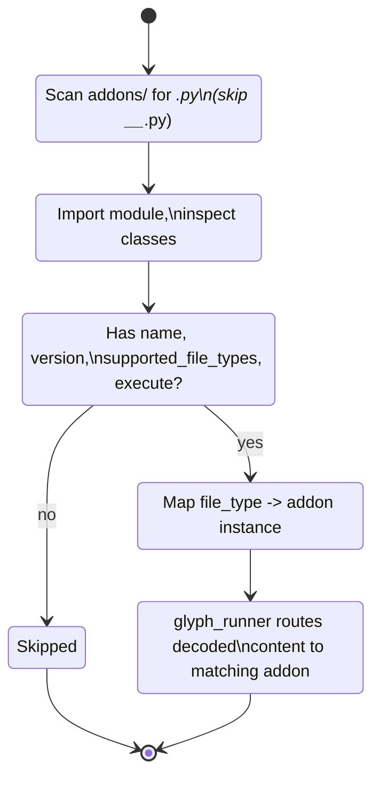

# Addons and Repository Overview

This document explains the addon system and provides a detailed breakdown of each addon present in the repository. It also documents the repository structure and how addons integrate with the `glyph_runner` execution flow.

---

## Table of Contents

- Addon System Overview
  - How addons are discovered and loaded
  - Addon lifecycle
  - Addon interface (what an addon must implement)
- List of Addons (installed in `/addons`)
  - Windows Batch Runner
  - HTML Viewer
  - Java Runner
- Writing your own addon
  - Minimum requirements
  - Example implementation
- Repository Structure
  - Explanation of top-level files and folders
- Usage & Examples
  - Encoding and running examples
- Security Considerations
- Debugging & Troubleshooting

---

## Addon System Overview

Addons are small plugins contained in the `addons/` directory that extend the `glyph_runner` capabilities to support additional file types beyond the built-in Python support.

Key files responsible for the addon system:
- `addons/base.py` — Contains the abstract base class `BaseAddon`, `AddonManager`, and the global helper `get_addon_manager()`.
- `glyph_runner.py` — Uses `AddonManager` to find and dispatch addons when a file type is detected.

### How Addons are Discovered and Loaded

1. At startup, `AddonManager()` is instantiated (via `get_addon_manager()` in `addons/base.py`).
2. The manager scans the `addons/` directory for `.py` files (excluding files that start with `__`).
3. Each potential module is loaded and inspected for classes that implement the addon interface (see `Addon interface` below).
4. Valid addon classes are instantiated and registered by `AddonManager`.
5. Addons are registered by file type. A mapping `file_type -> addon` is stored to route execution requests.

### Addon Lifecycle

- Discovery: Files scanned in the `addons/` folder
- Load: Module imported and classes inspected
- Validate: The class has required attributes/methods (`name`, `version`, `supported_file_types`, `execute`) and is instantiated
- Register: File types are mapped to addon instances
- Dispatch: When `glyph_runner` detects a file type it uses `AddonManager.execute_with_addon()` to run the content



### Addon Interface

Addons should either subclass `BaseAddon` or provide the required interface:
- `name` (property): A human-friendly name for the addon.
- `version` (property): Addon version string.
- `supported_file_types` (property): List of strings (file type keys) that the addon handles.
- `execute(content, filepath, **kwargs)` (method): Invoked with the plaintext (decoded) content and returns an exit code.
- Optional: `validate_content(content)` can be implemented for content validation.


## List of Addons

This section documents the available addons, what they do, how they work and important notes.

### Windows Batch Runner (file: `addons/batch.py`)

- Name: Windows Batch Runner
- Version: 1.0.0
- Supported types: `bat`, `cmd`, `batch`

What it does:
- Executes Windows batch script contents decrypted from `.glyph` files using the native `cmd.exe` command processor.
- Ensures a native no-download experience: Windows provides `cmd` by default and the addon does not require external software.

Key behavior:
- Validates content heuristically by checking for common batch command tokens. Even minimal one-line commands are supported.
- Creates a temporary `.bat` file, writes script content (UTF-8 by default with fallbacks), executes using `cmd.exe /c` and collects exit code.
- Cleans up temporary files unless `keep_temp=True` is passed.
- Optional kwargs supported: `keep_temp`, `temp_dir`, `no_pause`, `echo_on`, `timeout`, and `shell`.

Security considerations:
- Batch scripts run with the same privileges as the user running `glyph_runner`.
- Scripts have access to environment variables and system resources, so treat content as untrusted unless you control it.

Usage example:
```bash
python hiro.py encode --input script.bat --output script.glyph --key-type system --file-type bat
python glyph_runner.py script.glyph
```

---

### HTML Viewer (file: `addons/html.py`)

- Name: HTML Viewer
- Version: 1.0.0
- Supported types: `html`, `htm`

What it does:
- Validates and displays HTML content by creating a temporary `.html` file and opening it in a browser, or showing an inline view depending on flags.
- Optionally sets restrictive permissions and removes temporary files after viewing.

Key behavior:
- Basic structural validation checks (presence of `<html>`, `<!doctype html>`, `<head>`, or `<body>` tags).
- Writes a temp file with HTML and opens the default browser using `webbrowser.open()`.
- Supports options like `open_browser`, `save_temp`, `no_temp`, `cleanup_delay`, and `keep_temp`.

Security considerations:
- HTML content runs in the browser and must be treated as untrusted – it can include external links or scripts.
- Consider using options to disable auto browser opening if you want to inspect content programmatically first.

Usage example:
```bash
python hiro.py encode --input page.html --html --output page.glyph --key-type system
python glyph_runner.py page.glyph
```

---

### Java Runner (file: `addons/java.py`)

- Name: Java Runner
- Version: 1.0.0
- Supported types: `java`

What it does:
- Compiles and executes Java source code contained in a `.glyph` file.
- By default the addon attempts to use `javac` and `java` from the PATH. If those are absent, it may attempt fallbacks.

Key behavior:
- Performs basic validation (presence of `class` or `public static void main`).
- Detects package name and class name to correctly compile sources and run them.
- Creates temp files and run `javac`/`java`, capturing compile and runtime output.
- Supports `javac_cmd`, `java_cmd`, `keep_temp`, and `no_temp` flags.

Security considerations:
- Compilation and execution of arbitrary Java source files have obvious security implications (they run with the user’s permissions).
- Java processes could spawn sub-processes or access the filesystem or network.

Usage example:
```bash
python hiro.py encode --input hello.java --output hello.glyph --file-type java --key-type system
python glyph_runner.py hello.glyph
```

---

### Built-in: Python Execution (no addon required)

`glyph_runner.py` directly supports executing `python` type glyph files without an external addon. This built-in route performs in-memory execution for Python content when the `file-type` is `python` or the file content indicates a python script.

---

---

## Temporary Files vs Memory-Only Execution

Glyph Runner is explicitly designed to prioritize in-memory execution whenever possible. The goal is to minimize or eliminate persistent decrypted artifacts on disk and reduce the risk of data leakage or forensic capture.

Core memory-first behavior:
- The core decryption and integrity verification are performed in-memory. The `HieroglyphicEncoder.decode_message()` returns the decrypted message and file type without writing the plaintext to disk.
- For built-in Python files, `glyph_runner` uses `exec()` to execute code directly in memory:
  ```python
  # Example: In glyph_runner.py
  exec(content, {'__name__': '__main__'})
  ```
- The loader's bootstrap mechanism also uses in-memory execution to load the glyph core (`glyph_core.glyph`) without saving temporary files.

Why this matters:
- Eliminates unnecessary disk artifacts that could be recovered by forensic tools.
- Reduces opportunity for attackers to discover secrets by scraping files on disk.
- Maintains the confidentiality and integrity of decrypted content in volatile process memory.

When temporary files are unavoidable:
- Some addons use temporary files to interoperate with native system tools (e.g., launching a browser, running a system `cmd.exe` script, or compiling Java with `javac`). In those cases, temporary files are created and cleaned up carefully by the addon.
- `--no-temp` declares intent from the runner to avoid creating temporary files; addons that support this flag may run an alternate in-memory path (if available) or fail back to temp files if required.

Note: In-memory execution is an important security measure, but it is not a perfect substitute for system-level protections (e.g., kernel-level access, memory scraping, swap, or process dumps can still reveal content), which is covered in the Security section.

### Which Addons Use Temporary Files (current list)
- `HTML Viewer` (`addons/html.py`): Writes a temporary `.html` file by default to display in the browser. It supports `no_temp` mode which prints HTML to the console, and it attempts to schedule a secure cleanup process (overwrites file and deletes file after a delay) when the file was opened in the browser.
- `Windows Batch Runner` (`addons/batch.py`): Writes a temporary `.bat` file and executes it using `cmd.exe`. There is no in-memory `cmd` alternative in this addon; it always writes a temporary file and deletes it unless `keep_temp` is specified.
- `Java Runner` (`addons/java.py`): Usually writes Java source and compiled files to a temporary directory to compile (`javac`) and run (`java`), but supports a `no_temp` path using `jshell` if it is available (the `no_temp` flow runs entirely in memory via `jshell`). When using temporary files, the addon tries to securely wipe files and the temp directory (overwrite with zeros before deletion) before removal.
- `Built-in Python` (no addon): Executes in-memory without creating temporary files (unless your Python code itself writes files).

### How Addons Handle Temporary Files
- Addons that rely on temporary files follow these rules by convention:
  - Temp files are created in the system temporary directory by default (or a `temp_dir` if provided).
  - Addons attempt to clean up files after use. Some addons (HTML, Java) attempt to overwrite file contents before deletion to make recovery harder.
  - Addons may expose `keep_temp` to let developers keep the files for diagnostics.
  - Addons may implement `no_temp` when an in-memory execution path exists (e.g., Java `jshell`, HTML console print, Python default exec).

---
  
## Writing Your Own Addon

Addons are simple to implement. Either subclass `BaseAddon` or implement the following interface:

- `name`: property (string)
- `version`: property (string)
- `supported_file_types`: property (list of strings)
- `execute(self, content: str, filepath: str, **kwargs) -> int` : method returning system exit code
- `get_description(self) -> str` (optional)
- `validate_content(content)` (optional)

A minimal example:
```python
# myaddon.py
from addons.base import BaseAddon

class MyAddon(BaseAddon):
    @property
    def name(self):
        return 'My Custom Addon'

    @property
    def version(self):
        return '1.0.0'

    @property
    def supported_file_types(self):
        return ['mylang', 'mylang2']

    def execute(self, content, filepath, **kwargs):
        print('Running my addon...')
        # Process content
        return 0


# Save file under addons/myaddon.py and restart glyph_runner
```

When `glyph_runner` is executed it will automatically discover the custom addon and list it in `--list-addons` or `--addon-info`.

---

## Repository Structure (explained)

Top-level files and folders in the repo with explanations:

- `README.md` — Project overview and quick start (main documentation)
- `hiro.py` — Main encoder CLI and API for encoding/decoding messages to `.glyph` format.
- `glyph_runner.py` — The runtime for executing `.glyph` files with addon support
- `glyph_core.glyph` — The core encoder module stored in a glyph file
- `depo/` — backup files and helper scripts used to bootstrap the core
- `addons/` — Addon plugins, each in its own module (see below)
  - `__init__.py` — Package initializer
  - `base.py` — Addon base classes and manager
  - `html.py` — HTML viewer addon
  - `java.py` — Java runner addon
  - `batch.py` — Windows Batch runner addon
  - `BATCH_README.md` — Per-addon README
- `comprehensive_test/` — Extended test files and datasets
- `demo/` — Demo and example scripts showcasing features
- `docs/` — Project documentation (we add `ADDONS_OVERVIEW.md` here)
- `testing/` — Unit tests and helper scripts
- `workspace/` — Example/working scripts used for integration
- `requirements.txt`, `requirements-dev.txt` — Dependencies

Notes:
- `glyph_runner` uses `addons.base.AddonManager` to auto-load addons from `addons/`.
- Addon modules should be named with the file type (e.g., `java.py`) or custom names. The manager scans for `.py` files and instantiates classes that match the interface.
- Adding an addon is as simple as saving a new `.py` file under `addons/` and ensuring the defined class has the expected fields and methods.

---

## Usage & Examples

List addons:
```bash
python glyph_runner.py --list-addons
```

Get addon info:
```bash
python glyph_runner.py --addon-info
```

Basic addon usage (windows batch example):
```bash
# Encode
python hiro.py encode --input script.bat --output script.glyph --key-type system --file-type bat

# Execute
python glyph_runner.py script.glyph
```

If you implement a new addon, you can test discovery and execution by placing it into `addons/` and running:
```bash
python glyph_runner.py --list-addons
python glyph_runner.py --addon-info
```

---

## Security Considerations

- Addons execute in the same process as `glyph_runner` and have access to decrypted content.
- Treat addons as trusted code; avoid running untrusted addons in the default production runner.
- Scripts executed via addons (e.g., batch or Java) will run with the user's permissions.
- Use encryption options (`--key-type password`, `--key-type aes`) and exported system variables to secure and manage how files are executed across systems.

### Execution-in-memory design and the security model

Glyph Runner was built specifically to enable secure, memory-only execution of encrypted code and content where possible. This design lowers forensic visibility and helps prevent accidental leakage of decrypted assets. Key security decisions include:

- Core operations are memory-first:
  - The decryption step yields content in memory (strings/bytes) and returns them to the runner for immediate execution or dispatch to an addon.
  - The Python execution path uses `exec()` to evaluate code in process without creating a file on disk.

- System-bound keys:
  - The default `system` key type derives its key material from system hardware/software attributes. This binds encrypted files to the machine where they were created and makes them unusable on other machines unless system variables are exported and provided.

- Integrity checks:
  - The encoder embeds a strong SHA3-512 integrity hash. The runner verifies the integrity of the decrypted payload before executing the content — preventing tampering or replay attacks.

- Minimal attack surface:
  - By avoiding temporary files, the system minimizes the persistence of decrypted material on disk. For necessary temporary files (HTML/Batch/Java) the addons use secure deletion where possible or schedule delayed cleanup to prevent accidental reuse.

### How this resists common attacks

1. Disk Forensics: With memory-only execution, there is no persistent decrypted file or cleartext to find on disk. Addons that must use files attempt to securely overwrite and delete temporary files.

2. Tampering: The SHA3-512 integrity check stops arbitrary modifications from being executed — the runner detects tampering and refuses to execute the payload.

3. Unauthorized Execution: System-bound key derivation makes an encrypted file unusable on other machines (unless explicit `system_vars` export/import is used). Password and AES key types are available for portability but require a secret.

4. Supply-Chain / Addon Risk: Addons run in-process, so a malicious or compromised addon can access plaintext. We mitigate this via developer guidance, code review, and recommending signing or vetting of addons before use.

5. Execution Delegation Risks (native tools like `javac`/`cmd`): Some addons run external tools (e.g., `javac`, `java`, `cmd.exe`) that run under the user's privileges and could perform network or I/O operations. Users should run such content only from trusted sources, or in sandboxes (VMs/containers) when running untrusted code.

### Limitations & Residual Risks

No cryptographic design is bulletproof. The following residual risks remain:
- Memory scraping and process dumps can still capture decrypted content; use OS-level protections and secure execution environments if you need higher isolation.
- Swap/paging/hibernation might move memory content to disk. Modern OSs may offer tools to reduce this risk (e.g., encrypted pagefile), but this is beyond the scope of the glyph runner.
- System compromise (kernel rootkits, malicious admin) will subvert all protections — run security-sensitive workloads on hardened or isolated hardware where possible.

### Best Practices
- Use `--no-temp` when possible to force in-memory execution for addons that support it (Java `jshell`, HTML console view).
- Limit the use of `keep_temp` and only enable it for debugging.
- Run `glyph_runner` under an unprivileged account when executing untrusted glyph content.
- Use system keys for machine-bound secrets. Use password or AES keys for portable content, but rotate and protect keys properly.
- Avoid running untrusted addons without code review and verification; consider signing your internal addon repository.
- Prefer containerization or virtualization for running third-party glyph content (e.g., untrusted Java programs or batch scripts).


---

## Debugging & Troubleshooting

- If your addon does not load:
  - Confirm the module is placed in `addons/` and is a `.py` file (not `__init__.py`).
  - Ensure the class has `name`, `version`, `supported_file_types` properties and an `execute()` method.
  - Use `python glyph_runner.py --list-addons` and `--addon-info` for diagnostic messages.

- If the addon is loaded but failing at execution:
  - Add explicit exception handling in `execute()` and print meaningful debug info.
  - Respect `keep_temp` for troubleshooting; keep the temporary files created by the addon.

---

## Appendix: Addon Manager Source Snippets

`addons/base.py` contains `AddonManager` scanning code. Here is a condensed review of its key logic:

```python
# loader pseudo-code
for filename in os.listdir(addons_path):
    if filename.endswith('.py') and not filename.startswith('__'):
        module = load_module(filename)
        for name, cls in inspect.getmembers(module):
            if inspect.isclass(cls) and hasattr(cls, 'name') and hasattr(cls, 'version') and hasattr(cls, 'supported_file_types') and hasattr(cls, 'execute'):
                instance = cls()
                register(instance)
```

This manager maps file types to addon instances and performs content validation and execution via `execute_with_addon(file_type, content, filepath)`.

---

## Final notes

This document provides the foundation for understanding how addons work and how to extend the project with custom behavior. Addons increase the versatility of the `glyph_runner` and help you create secure, portable, and convenient workflows with encrypted scripts.

If you want me to convert this into `docs/ADDONS_OVERVIEW.md` in a different format (e.g., as part of a Sphinx doc tree or a dedicated `ADDONS.md` placed inside `addons/`), let me know and I can adjust.
