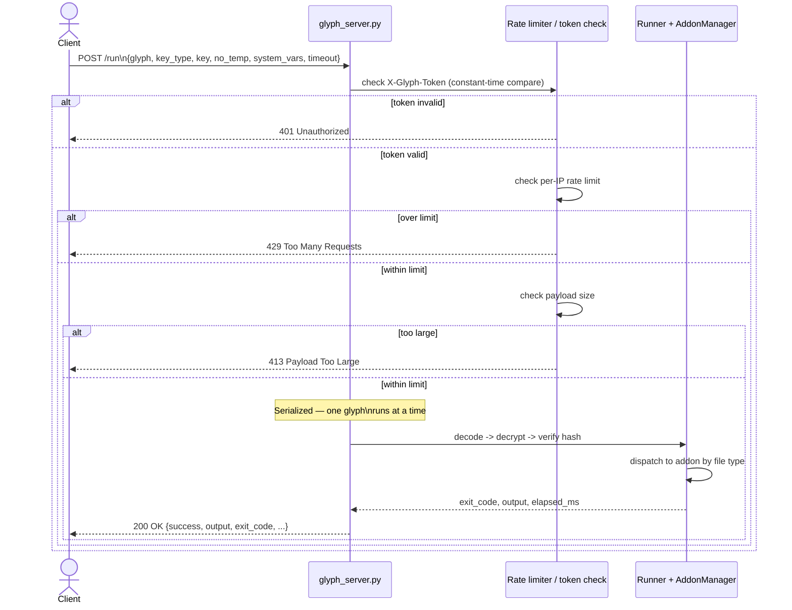

Glyph Server Security and Threat Model
=====================================

This document explains the security implications of the `glyph_server.py` service and the live execution vector that the Glyph project exposes.

Overview
--------

The Glyph HTTP server is not just a playful demo runner. It is a live remote execution endpoint that:

- receives encrypted glyph payloads over HTTP
- decrypts and decodes them in memory
- executes the result as Python or via addon handlers
- returns captured output in JSON

That means the server is a payload transport and execution channel, not merely a file viewer.

Server features
---------------

The server provides these capabilities:

- `POST /run`
  - accepts a JSON payload containing `glyph`, `key_type`, `key`, `no_temp`, `system_vars`, and `timeout`
  - returns `success`, `exit_code`, `output`, `file_type`, `error`, and `elapsed_ms`
- authorization
  - requires `X-Glyph-Token`
  - uses constant-time comparison for token validation
- rate limiting
  - per-IP request throttling prevents unlimited abuse
- payload size restriction
  - hard limit on request body size to reduce oversized uploads
- serialized execution
  - only one glyph runs at a time to keep stdout/stderr capture thread-safe
- addon support
  - supports extension types such as HTML, JavaScript, Java, Batch, and TypeScript

*This is a live remote-code-execution endpoint by design. Every arrow above is a trust boundary — deploy it only behind network access control, with a strong token, and only for payloads you already trust.*

What the demo shows
-------------------

The demo payload is `bouncing_popups.py`: a Tkinter GUI script with borderless windows that bounce around the screen, each displaying a countdown timer and an animated GIF. Every time the countdown reaches zero the entire group doubles in size, freezes for a pause period, then resumes.

This is intentionally designed to be visible and theatrical. The point is to make execution undeniable: if the glyph ran, you will know about it.

But the demo is also a deliberately restrained version of something that can escalate very quickly.

The benign configuration, and why it was chosen deliberately
------------------------------------------------------------

`bouncing_popups.py` ships with conservative settings that keep it annoying without being destructive:

    COUNTDOWN_SECS = 10   # 10-second round duration
    PAUSE_SECS     = 5    # 5-second freeze before each doubling
    MAX_DOUBLINGS  = 10   # cap at 10 doublings after the first round
    INITIAL_COUNT  = 1    # start with a single popup

These numbers were chosen carefully. The result is an 11-round sequence that stays uncomfortable but manageable on most machines through the early rounds. It terminates after round 11 rather than running forever.

The popup count at each round follows a pure doubling sequence from a single starting popup:

  Round  |  Popups on screen
  -------|------------------
    1    |  1
    2    |  2
    3    |  4
    4    |  8
    5    |  16
    6    |  32
    7    |  64
    8    |  128
    9    |  256
   10    |  512
   11    |  1,024

By round 11 there are over 1,000 active tk.Toplevel windows on screen simultaneously. Every single one is:

- animating a GIF at up to 60 frames per second
- calling geometry() on itself every frame to update its position
- participating in an AABB collision resolution pass that runs across every popup pair
- receiving after() callbacks on the Tkinter main loop

On a modest consumer laptop this is already enough to saturate the CPU, exhaust GDI handles on Windows, and cause the desktop environment to become unresponsive or crash. The script reaches this state slowly and dramatically so the effect is visible and attributable. It is prank-shaped but resource-exhaustion-capable.

The settings were deliberately kept at this ceiling, not below it, to prove the point without being gratuitous.

How a malicious payload could weaponise the same script
-------------------------------------------------------

The settings above are just Python constants at the top of the file. A remote sender who controls the payload content can set them to anything.

Consider what happens if a sender replaces the defaults with:

    COUNTDOWN_SECS = 1    # rounds expire in 1 second
    PAUSE_SECS     = 0    # no freeze before doubling
    MAX_DOUBLINGS  = 20   # 21 rounds instead of 11
    INITIAL_COUNT  = 4    # start with 4 popups instead of 1

The popup count now grows from 4 and compounds every second:

  Round  |  Popups on screen
  -------|------------------
    1    |  4
    5    |  64
   10    |  2,048
   15    |  65,536
   20    |  2,097,152
   21    |  4,194,304

With a 1-second round time and no pause, a system hits 65,000 windows in under 15 seconds. At that level Python is attempting to create millions of Tkinter objects and the OS will either hard-freeze or kernel-panic. Recovery requires a forced reboot. This is a denial-of-service attack against the local desktop, carried entirely inside a script that looks like a silly prank.

The key point is that the sender decides these numbers, not the recipient. The payload arrives encrypted. The recipient cannot read it before it executes.

Startup persistence via malicious payload
-----------------------------------------

The popup script is one example of what can be executed. It is not the most dangerous kind of payload. A more realistic threat is a payload that configures itself to survive reboots.

Examples of startup configuration that are trivially achievable in a Python payload and do not require elevated privileges on Windows:

- Writing a .lnk shortcut to %APPDATA%\Microsoft\Windows\Start Menu\Programs\Startup
- Adding a registry value under HKCU\Software\Microsoft\Windows\CurrentVersion\Run
- Installing a scheduled task via a schtasks subprocess call
- Writing a cron entry on Linux via crontab -l and crontab -
- Modifying ~/.bashrc, ~/.zshrc, or ~/.profile on Unix systems

None of these require admin rights. All of them can be done silently inside an exec() call. The glyph server provides no sandboxing, no file system isolation, and no syscall filtering. The payload runs with the same privileges as the Python process hosting the server.

A startup-persistence payload combined with the server itself creates a feedback loop:

1. Payload arrives via POST /run
2. Payload installs the glyph server as a startup item
3. Machine reboots; server restarts automatically
4. Attacker continues sending payloads to the persistent server indefinitely

The demo script does none of this. It was carefully written not to. But the execution channel it travels through places no restrictions on what could.

Why the real risk is much greater
---------------------------------

### Live payload execution

A glyph payload can contain arbitrary code once decoded. The popup script is one possible payload shape among unlimited others.

### Hidden and embedded server

The HTTP server is small and pure-Python. It can be embedded into or launched from:

- desktop applications
- installers
- helper services
- automation tools
- existing Python processes

A server like this can be dropped into many environments with minimal changes and can listen on any port.

### Opaque transmission

Glyphs are not plain text source code. They are a custom encoded and encrypted symbol stream.

- static scanners cannot easily determine what a glyph contains
- antivirus engines and services like VirusTotal are unlikely to identify the payload intent correctly because they see only the outer symbol encoding, not the inner script
- the glyph is only useful to the exact hiro/glyph runtime
- even a human reading the glyph file cannot determine whether it contains a prank, a keylogger, or a persistence installer

### Dangerous vector

Because the glyph server accepts encrypted payloads and executes them remotely, it becomes a vector for:

- remote code execution
- resource exhaustion and local denial of service
- startup persistence without elevated privileges
- hidden payload delivery
- data exfiltration
- secondary downloader stages
- lateral movement

This is not a harmless prank channel. It is a remote execution tunnel that can be used to deliver many kinds of payloads. The demo payload happens to be a prank. The channel itself does not care.

Recommended caution
-------------------

If you are using or reviewing this project, keep these rules in mind:

1. Treat glyph_server.py as a powerful execution endpoint, not a toy.
2. Do not expose it on untrusted networks under any circumstances.
3. Use strong, secret auth tokens and rotate them regularly.
4. Understand that glyph payloads are completely opaque without the decoder.
5. Consider the server a potential security risk even when the visible payload looks benign.
   The settings controlling how severe it is are inside the glyph, invisible to the recipient.
6. Do not run the server with elevated privileges unless absolutely necessary.

Appendix: why the prank is a useful demonstration
--------------------------------------------------

A prank-style payload is the right choice for a demonstration because:

- it makes execution impossible to mistake: the user sees immediate, obvious effects
- it demonstrates resource exhaustion in a recoverable form at human-observable speed
- the exponential doubling mechanic makes the growth curve tangible and educational
- it shows that the payload drives its own behaviour through its own configuration constants
- the sender controlling those constants is the clearest possible illustration of remote behavioural control

The demo was tuned to sit at the edge of what is acceptable. It will genuinely stress a basic machine by round 10 or 11 but still terminates naturally. Anything beyond those settings crosses from demonstration into damage.

The pipeline that delivered the prank, AES glyph over HTTP POST with token auth and in-memory exec, is identical to the pipeline that could deliver anything else. That is the point of the demo.
